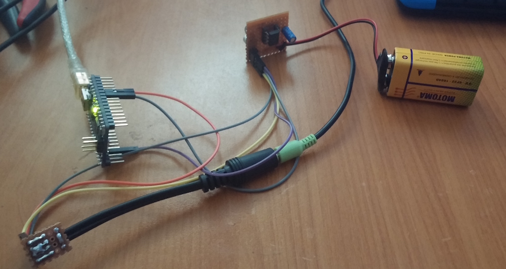

## FM synthesiser with XmegaE5

Proof of concept, MIDI capable polyphonic FM synthesiser implemented with xmegaE5

### Notes

* System uses xmega's internal DAC for audio output. 
* At the moment there are 6 different voices with 12.5 kHz update rate.
* Each voice has seperate amplitude and modulation envelope with adjustable attack,decay and release parameters.
* System has adjustable low-pass filter at the output stage.
* System has frequency and depth adjustable LFO at the output stage.
* All of the calculations are done in 8bit math. 
* Most of the parameters are adjustable over MIDI control messages.
* Each voice calculated with 8bit precision and summed up directly at the output without precision loss since we are using 12bit DAC.

### How does it sound like?

You can find a sound sample from the following soundcloud link: <https://soundcloud.com/ihsankehribar/moonlight-synth>

I used Hairless MIDI <http://projectgus.github.io/hairless-midiserial/> application to forward pre-recorded MIDI file from my computer to microcontroller over serial port. I also played with some of the synth parameters while recording to demonstrate changes.

### Demo setup

* I used my xmegaE5 development board <http://kehribar.me/hardware/breakout_xmegaE5/> for the main environment.
* Later for testing, I soldered a small Sallen-Key 2nd order lowpass filter board to filter high frequency noise generated by rather low update rate of the synthesiser.
* Signal chain is as follows: *xmegaE5 DAC --> lowpass board with AC coupled output --> 3.5mm audio jack*

### References

* Math functions are coming from Mutable Instruments' open source codebase. <https://github.com/pichenettes> 